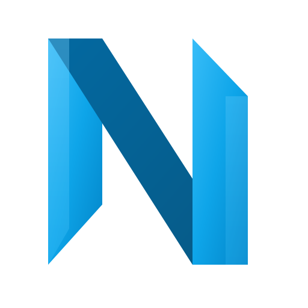

<p align="center">
  
</p>

<h1 align="center">🚀 Nexus Lean</h1>

<p align="center">
  <strong>El Sistema Operativo para la Excelencia Operacional 4.0</strong>
</p>

<p align="center">
  <em>Transformando la gestión Lean tradicional en una experiencia digital, fluida y poderosa.</em>
</p>

<p align="center">
  <a href="#-filosofía-lean-digital">Filosofía</a> •
  <a href="#-potencia-y-dinámica">Capacidades</a> •
  <a href="#-stack-tecnológico">Tecnología</a> •
  <a href="#-experiencia-ultra-blue">Diseño</a> •
  <a href="#-comenzar">Instalación</a>
</p>

<p align="center">
  
  
  
  
  
</p>

---

## 💡 Filosofía: Lean Digital

**Nexus Lean** no es solo un gestor de tareas; es la cristalización digital de la metodología Kaizen. Diseñado para eliminar el *Muda* (desperdicio) en la gestión de la mejora continua, automatizando flujos administrativos para que los ingenieros se concentren en lo que importa: **resolver problemas**.

> "Donde la Excelencia Operacional se encuentra con la Ingeniería de Software Avanzada."

### 🔄 Dinámica de Flujo (The Lean Flow)

La plataforma está arquitecturada siguiendo el ciclo **PDCA (Plan-Do-Check-Act)**, garantizando que ninguna iniciativa se pierda en el "valle de la muerte" de los proyectos.

1.  **Detectar (See)**: Captura de anomalías en planta con **Tarjetas 5S Digitales** (Offline-First).
2.  **Analizar (Solve)**: Solución de problemas complejos mediante **A3 Thinking**, **Ishikawa** y **5 Whys** interactivos.
3.  **Estandarizar (Standardize)**: Auditorías digitales con feedback inmediato.
4.  **Sostener (Sustain)**: Dashboards automatizados que mantienen la tensión creativa del equipo.

---

## 🔥 Potencia y Dinámica del Software

Nexus Lean rompe las barreras de las herramientas tradicionales (Excel, papel) ofreciendo capacidades de nivel empresarial:

### 1. 🚀 Motor de Ejecución A3 (Problem Solving)
Olvídate de los A3 en papel. Nuestro módulo digital guía al usuario a través del pensamiento lógico:
*   **Ishikawa Dinámico**: Construcción visual de causas raíces con drag-and-drop mental.
*   **Trazabilidad Total**: Desde la definición del problema hasta la validación de la contramedida.
*   **Consultor IA**: Integración con Gemini AI para sugerir causas potenciales basadas en el contexto del problema.

### 2. ⚡ Gestión de Hallazgos en Tiempo Real (5S & Quick Wins)
La velocidad es clave. Nexus Lean permite:
*   **Captura Instantánea**: Fotos y descripciones desde el móvil, directamente en el Gemba.
*   **Modo Offline Real**: ¿Sin señal en la planta? No hay problema. Los módulos de **Tarjeta 5S** y **Auditoría** funcionan 100% desconectados y sincronizan al retomar conexión.
*   **Feedback Loop**: Notificaciones automáticas a los responsables de área al instante.

### 3. 🛡️ Auditorías Inteligentes
*   **Radares de Madurez**: Visualización automática en gráficos de araña (Radar Charts) para comparar el nivel de 5S entre áreas.
*   **Tendencias Históricas**: Análisis de la evolución cultural del equipo a lo largo del tiempo.

### 4. 🏢 Arquitectura Multi-Tenant (SaaS)
Diseñado para escalabilidad masiva:
*   **Aislamiento de Datos**: Seguridad robusta (RLS) separando lógicamente los datos de cada cliente/planta.
*   **Gestión Centralizada**: Ideal para consultoras que gestionan múltiples clientes desde un solo "Centro de Mando".

---

## 🎨 Experiencia "Nexus Lean Ultra Blue"

El software empresarial no tiene por qué ser aburrido. Hemos implementado un lenguaje de diseño **Premium Dark** que redefine la UX industrial:

*   **Inmersión Total**: El modo oscuro profundo (`#050B14`) reduce la fatiga visual en entornos de planta con iluminación variable.
*   **Feedback Visual**: Gradientes cian y azules eléctricos indican estados activos, guiando el ojo del usuario de forma subconsciente.
*   **Zero-Latencia Perciibida**: Optimizaciones extremas en el renderizado para transiciones instantáneas (<100ms).

---

## 🛠️ Stack Tecnológico de Alto Rendimiento

Construido sobre hombros de gigantes para garantizar estabilidad, seguridad y velocidad.

| Capa | Tecnología | Propósito |
|:---|:---|:---|
| **Frontend** | **React 18 + Vite** | Renderizado ultra-rápido y SPA (Single Page Application). |
| **Estilos** | **TailwindCSS** | Diseño atómico, responsive y consistente. |
| **Backend (BaaS)** | **Supabase** | Potencia de PostgreSQL con APIs en tiempo real. |
| **Seguridad** | **RLS (Postgres)** | Seguridad a nivel de fila en base de datos. Inquebrantable. |
| **Gráficos** | **Recharts** | Visualización de datos vectoriales fluidos. |
| **PWA** | **Vite PWA Plugin** | Instalable nativamente en iOS y Android. |

---

## 🚀 Comenzar (Despliegue Local)

¿Listo para experimentar la potencia de Nexus Lean?

### Prerrequisitos
*   Node.js 18+
*   Cuenta de Supabase

### Pasos
1.  **Clonar el repositorio:**
    ```bash
    git clone https://github.com/tu-usuario/nexus-lean.git
    cd nexus-lean
    ```

2.  **Instalar dependencias:**
    ```bash
    npm install
    ```

3.  **Configurar entorno:**
    Crea un archivo `.env` basado en `.env.example` y añade tus llaves de Supabase.

4.  **Iniciar motor:**
    ```bash
    npm run dev
    ```

---

<p align="center">
  <strong>Diseñado para la Excelencia. Codificado para el Rendimiento.</strong><br>
  Hecho con ❤️ por <strong>Ariel Mella González</strong>
</p>
