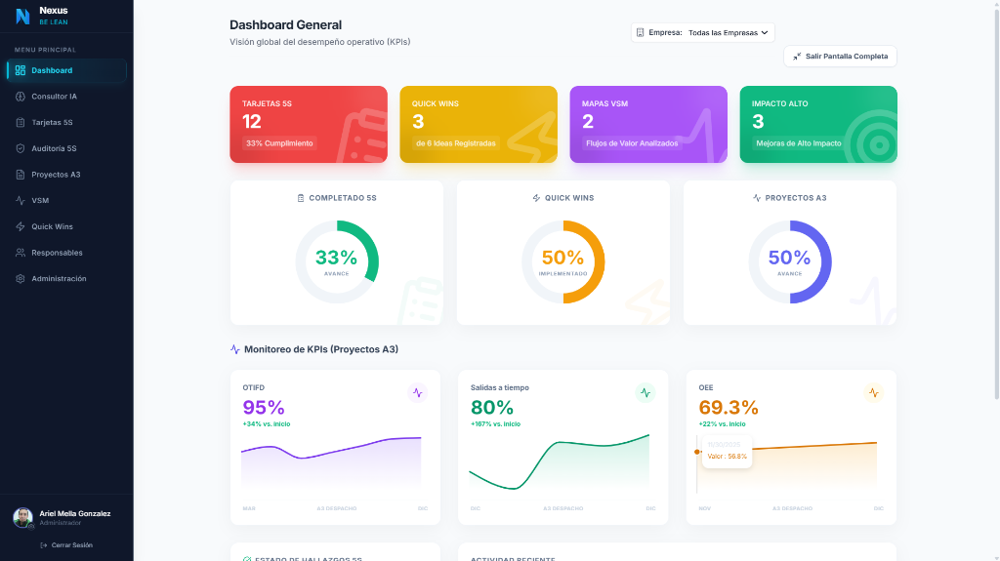
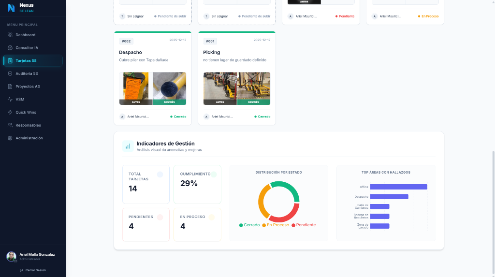
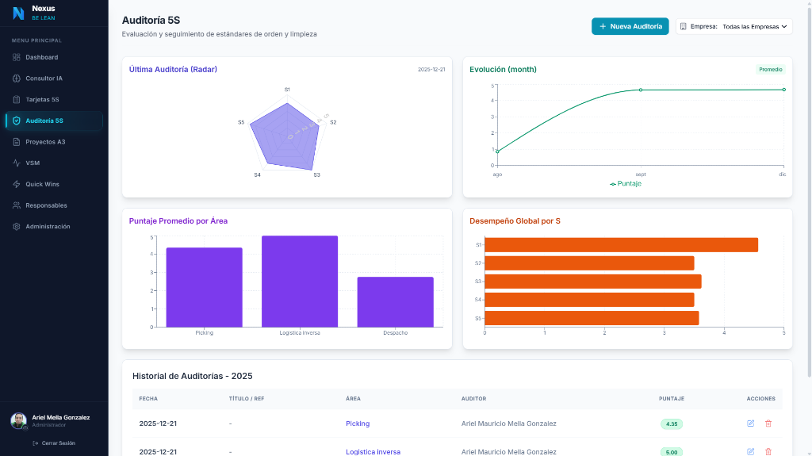
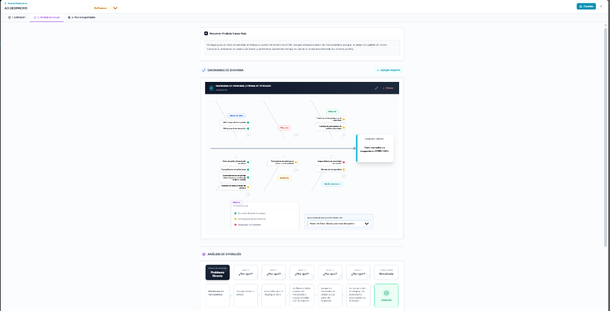
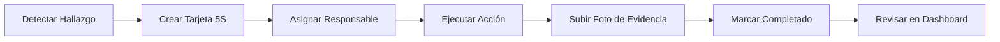

<p align="center">
  
</p>

<h1 align="center">🚀 Nexus BE LEAN</h1>

<p align="center">
  <strong>Plataforma integral de Gestión de Mejora Continua para organizaciones que buscan la excelencia operacional</strong>
</p>

<p align="center">
  <a href="#características-principales">Características</a> •
  <a href="#módulos">Módulos</a> •
  <a href="#tecnologías">Tecnologías</a> •
  <a href="#instalación">Instalación</a> •
  <a href="#uso">Uso</a> •
  <a href="#capturas">Capturas</a>
</p>

<p align="center">
  
  
  
  
</p>

---

## 📋 Descripción

**Nexus BE LEAN** es una solución **SaaS moderna y potente** diseñada específicamente para **consultoras de mejora continua** y organizaciones que implementan metodologías Lean, Six Sigma y Kaizen. 

La plataforma centraliza todas las herramientas necesarias para gestionar proyectos de mejora, auditorías, acciones correctivas y el seguimiento de responsables, eliminando la dispersión de información en hojas de Excel, documentos físicos y múltiples sistemas.

### 🎯 ¿Por qué Nexus BE LEAN?

| Problema Actual | Solución Nexus BE LEAN |
|-----------------|------------------------|
| ❌ Información dispersa en Excel | ✅ Base de datos centralizada en la nube |
| ❌ Seguimiento manual de acciones | ✅ Dashboards en tiempo real con alertas automáticas |
| ❌ Auditorías en papel | ✅ Auditorías digitales con gráficos de radar y tendencias |
| ❌ Pérdida de historial | ✅ Trazabilidad completa de cada acción y proyecto |
| ❌ Comunicación fragmentada | ✅ Sistema de notificaciones por email integrado |
| ❌ Acceso limitado a oficina | ✅ PWA accesible desde cualquier dispositivo móvil |

---

## ✨ Características Principales

### 🏢 Multi-Empresa y Multi-Usuario
- **Gestión de múltiples empresas/clientes** desde una única instancia
- **Roles y permisos**: Administradores y usuarios con accesos diferenciados
- **Filtrado dinámico** por empresa para consultores que gestionan varios clientes
- **Autenticación segura** con sistema de autorización de nuevos usuarios

### 📊 Dashboard Ejecutivo
- **KPIs en tiempo real** con tarjetas de estadísticas interactivas
- **Gráficos de progreso** por estado de hallazgos (5S, Quick Wins, A3)
- **Vista de actividades pendientes** consolidadas
- **Modo pantalla completa** para presentaciones en reuniones Gemba

### 📧 Sistema de Notificaciones Inteligente
- **Recordatorios automáticos por email** para tareas pendientes
- **Resumen de tareas por responsable** con fechas límite
- **Categorización visual** (📌 Pendientes, ⚠️ Atrasadas, ✅ Completadas)

### 📱 Diseño Responsivo y PWA
- **Progressive Web App**: instalable en celulares y tablets
- **Diseño mobile-first** optimizado para trabajo en planta
- **Captura de fotos directa** desde la cámara del dispositivo
- **Funcionamiento offline** para tarjetas 5S y auditorías

### ⚡ Rendimiento Optimizado
- **Precarga inteligente de datos**: Las tarjetas 5S y datos de responsables se cargan en segundo plano al iniciar sesión
- **Navegación instantánea**: Sin tiempos de espera al cambiar entre módulos
- **DataContext global**: Gestión centralizada del estado de la aplicación

### 🤖 Consultor IA Integrado
- **Análisis inteligente** de proyectos A3 con Gemini AI
- **Sugerencias automáticas** basadas en datos de la empresa
- **Chat interactivo** para consultas sobre mejora continua

---

## 🛠️ Módulos

### 1. 📋 Tarjetas 5S
El corazón de cualquier programa de orden y limpieza.

**Funcionalidades:**
- ✅ Creación de tarjetas rojas/amarillas con detección de hallazgos
- ✅ Captura fotográfica del antes y después
- ✅ Asignación de responsables con fechas límite
- ✅ Seguimiento de estados: *Pendiente → En Progreso → Completado*
- ✅ Clasificación por tipo de hallazgo y área
- ✅ Estadísticas de resolución por período

**Campos de tarjeta:**
| Campo | Descripción |
|-------|-------------|
| Artículo | Elemento identificado |
| Área | Ubicación física del hallazgo |
| Razón | Motivo de la tarjeta (innecesario, mal ubicado, etc.) |
| Responsable | Persona asignada para la acción |
| Fecha Límite | Deadline para la corrección |
| Estado | Pendiente / En Progreso / Completado |
| Foto | Evidencia visual del hallazgo |

---

### 2. 🛡️ Auditorías 5S
Sistema completo de evaluación de las 5S con análisis avanzado.

**Funcionalidades:**
- ✅ **Cuestionarios personalizables** por cada S (Seiri, Seiton, Seiso, Seiketsu, Shitsuke)
- ✅ **Puntuación de 0 a 5** por pregunta
- ✅ **Gráfico de Radar** para visualización inmediata del nivel de madurez
- ✅ **Gráfico de Tendencias** histórico por área
- ✅ **Comparativa de áreas** con barras horizontales
- ✅ **Cumplimiento por S** desglosado con indicadores visuales

**Preguntas de ejemplo incluidas:**
- S1 (Clasificar): ¿Se han eliminado los elementos innecesarios del área?
- S2 (Ordenar): ¿Cada herramienta tiene un lugar asignado y está en él?
- S3 (Limpiar): ¿El área de trabajo está limpia y sin manchas?
- S4 (Estandarizar): ¿Existen instrucciones visuales de los estándares?
- S5 (Disciplina): ¿Se realizan auditorías periódicas?

---

### 3. 📄 Proyectos A3
Gestión completa de proyectos de mejora con metodología A3 Thinking.

**Componentes incluidos:**
- ✅ **Diagrama de Ishikawa (Causa-Efecto)**: hasta 6 categorías de causas con carga de imagen
- ✅ **5 Por Qués (5 Whys)**: análisis de causa raíz iterativo
- ✅ **Plan de Acción**: matriz con acciones, responsables, fechas y estados
- ✅ **Seguimiento y Verificación**: gráficos de indicadores antes/después
- ✅ **Múltiples Ishikawas por proyecto** para análisis complejos
- ✅ **Textarea autoajustables** para documentación extensiva

**Estructura del A3:**
```
┌─────────────────────────────────────────────────────┐
│  PROBLEMA / CONTEXTO                                │
├─────────────────────────────────────────────────────┤
│  SITUACIÓN ACTUAL    │  OBJETIVO                    │
├───────────────────────┼─────────────────────────────┤
│  ANÁLISIS DE CAUSA   │  CONTRAMEDIDAS              │
│  (Ishikawa / 5 Whys) │  (Plan de Acción)           │
├───────────────────────┴─────────────────────────────┤
│  PLAN DE IMPLEMENTACIÓN                             │
├─────────────────────────────────────────────────────┤
│  SEGUIMIENTO / VERIFICACIÓN                        │
└─────────────────────────────────────────────────────┘
```

---

### 4. 📈 VSM (Value Stream Mapping)
Mapeo de flujo de valor para identificar desperdicios.

**Funcionalidades:**
- ✅ Registro de procesos mapeados
- ✅ Carga de imágenes de diagrama VSM
- ✅ Descripción de estado actual vs estado futuro
- ✅ Seguimiento de estados con ticker visual
- ✅ Asignación de responsables

---

### 5. ⚡ Quick Wins
Captura y gestión de mejoras rápidas con alto impacto.

**Funcionalidades:**
- ✅ **Tablero Kanban** visual (Idea → En Progreso → Completado)
- ✅ **Clasificación por impacto**: Bajo, Medio, Alto
- ✅ **Fotos antes/después** para evidencia visual
- ✅ **Área y responsable** asignados
- ✅ **Modal de completado** con resultado y fecha
- ✅ Estadísticas de ideas implementadas

---

### 6. 👥 Panel de Responsables
Vista consolidada de carga de trabajo por persona.

**Funcionalidades:**
- ✅ **Vista por responsable** con todas sus tareas
- ✅ **Agrupación por tipo**: 5S, Quick Wins, A3, VSM
- ✅ **Indicadores de estado**: Completadas, En Progreso, Pendientes, Atrasadas
- ✅ **Gráfico de barras** de distribución de carga
- ✅ **Envío de recordatorios por email** directo desde la plataforma
- ✅ **Navegación rápida** a cada tarea

---

### 7. ⚙️ Administración
Panel exclusivo para administradores.

**Funcionalidades:**
- ✅ **Gestión de empresas/clientes**
- ✅ **Gestión de usuarios**: autorización, roles, asignación de empresa
- ✅ **Purga de datos legacy** para limpieza de base de datos
- ✅ Visualización de usuarios pendientes de autorización

---

## 🏗️ Arquitectura Técnica

```
┌─────────────────────────────────────────────────────────────┐
│                      FRONTEND (React + Vite)                │
│  ┌─────────────┐ ┌─────────────┐ ┌─────────────────────────┐│
│  │   Pages     │ │ Components  │ │   Context (Auth)        ││
│  └─────────────┘ └─────────────┘ └─────────────────────────┘│
│  ┌─────────────┐ ┌─────────────┐ ┌─────────────────────────┐│
│  │  Services   │ │   Utils     │ │   Layouts               ││
│  └─────────────┘ └─────────────┘ └─────────────────────────┘│
└─────────────────────────────────────────────────────────────┘
                              │
                              ▼
┌─────────────────────────────────────────────────────────────┐
│                     SUPABASE (BaaS)                         │
│  ┌──────────────────┐  ┌────────────────┐  ┌──────────────┐│
│  │  Authentication  │  │   PostgreSQL   │  │   Storage    ││
│  │   (Auth Users)   │  │   (Database)   │  │   (Images)   ││
│  └──────────────────┘  └────────────────┘  └──────────────┘│
│  ┌──────────────────────────────────────────────────────┐  │
│  │              Row Level Security (RLS)                │  │
│  │        Políticas por empresa y rol de usuario        │  │
│  └──────────────────────────────────────────────────────┘  │
└─────────────────────────────────────────────────────────────┘
```

### 📦 Estructura de Base de Datos

| Tabla | Descripción |
|-------|-------------|
| `companies` | Empresas/clientes registrados |
| `profiles` | Perfiles de usuario con rol y empresa asignada |
| `five_s_cards` | Tarjetas 5S |
| `audit_5s` | Cabeceras de auditorías 5S |
| `audit_5s_entries` | Detalle de preguntas y puntuaciones |
| `a3_projects` | Proyectos A3 con toda la información estructurada |
| `vsm_items` | Registros de Value Stream Mapping |
| `quick_wins` | Ideas y Quick Wins |

---

## 📸 Galería de Capturas <a name="capturas"></a>

<div align="center">

<h3>Dashboard Ejecutivo</h3>
<p>Visión integral de KPIs, cumplimiento de 5S y estado de proyectos.</p>


<br><br>

<h3>Gestión Visual de Hallazgos (5S)</h3>
<p>Tableros Kanban interactivos para el seguimiento de tarjetas rojas y amarillas.</p>


<br><br>

<h3>Indicadores de Gestión</h3>
<p>Análisis detallado de anomalías, distribución por estado y áreas críticas.</p>


<br><br>

<h3>Auditorías 5S Digitales</h3>
<p>Resultados inmediatos con gráficos de radar y comparativas por área.</p>


<br><br>

<h3>Proyectos A3 y VSM</h3>
<p>Herramientas avanzadas de resolución de problemas (Ishikawa) y mapeo de valor.</p>


</div>

---

## 💻 Tecnologías

| Categoría | Tecnología | Versión |
|-----------|------------|---------|
| **Frontend** | React | 18.2.0 |
| **Build Tool** | Vite | 5.2.0 |
| **Estilos** | TailwindCSS | 3.4.17 |
| **Iconos** | Lucide React | 0.561.0 |
| **Gráficos** | Recharts | 3.6.0 |
| **Routing** | React Router DOM | 7.10.1 |
| **Backend** | Supabase | 2.87.3 |
| **PWA** | Vite Plugin PWA | 1.2.0 |

---

## 🚀 Instalación

### Prerrequisitos
- Node.js 18+ 
- npm o yarn
- Cuenta en [Supabase](https://supabase.com)

### Pasos

1. **Clonar el repositorio**
```bash
git clone https://github.com/tu-usuario/nexus-be-lean.git
cd nexus-be-lean
```

2. **Instalar dependencias**
```bash
npm install
```

3. **Configurar variables de entorno**
```bash
cp .env.example .env
```

Editar `.env` con tus credenciales de Supabase:
```env
VITE_SUPABASE_URL=https://tu-proyecto.supabase.co
VITE_SUPABASE_ANON_KEY=tu-anon-key
```

4. **Configurar base de datos**

Ejecutar el script SQL en el editor de Supabase:
```sql
-- Ver archivo: supabase_schema.sql
```

5. **Iniciar servidor de desarrollo**
```bash
npm run dev
```

6. **Abrir en el navegador**
```
http://localhost:5173
```

---

## 📖 Uso

### Primer acceso

1. **Registro**: Crear una cuenta con email y contraseña
2. **Autorización**: Un administrador debe autorizar al nuevo usuario
3. **Asignación**: El admin asigna la empresa correspondiente
4. **Acceso**: El usuario puede ingresar y ver datos de su empresa

### Flujo típico de trabajo



---

## 🎨 Diseño UI/UX

El diseño de Nexus BE LEAN sigue principios modernos:

- 🌙 **Dark Mode** por defecto para reducir fatiga visual
- 🎨 **Paleta de colores** consistente con tonos cyan/blue profesionales
- 📐 **Componentes reutilizables** con estilos uniformes
- ✨ **Micro-animaciones** para mejor experiencia de usuario
- 📱 **Mobile-first** para uso en planta de producción

---

## 🔐 Seguridad

- **Row Level Security (RLS)** en todas las tablas
- **Políticas por empresa**: cada usuario solo ve datos de su empresa
- **Roles diferenciados**: admin vs user
- **Autenticación OAuth** compatible con providers de Supabase
- **Autorización explícita** de nuevos usuarios por admins

---

## 📈 Roadmap

- [ ] Integración con Microsoft Teams / Slack
- [ ] Exportación a PDF de reportes
- [ ] Módulo de Kanban personalizable
- [ ] App nativa iOS/Android
- [ ] Integración con sistemas ERP
- [ ] Dashboard de BI avanzado
- [ ] Modo offline completo

---

## 🤝 Soporte

Para consultas, demostraciones o implementación personalizada:

📧 **Email**: ariel.mellag@gmail.com  


---

## 👨‍💻 Autor

**Ariel Mella González**  
📧 ariel.mellag@gmail.com

---

## 📄 Licencia

Este proyecto es propietario. Todos los derechos reservados © 2025.

Para uso comercial o personalización, contactar al desarrollador.

---

<p align="center">
  <strong>Desarrollado con ❤️ por Ariel Mella González para impulsar la Mejora Continua en Latinoamérica</strong>
</p>

<p align="center">
  
</p>
